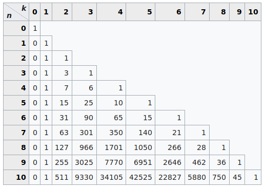

# Programação assembly RISC-V: Triângulo de Stirling #

Este trabalho é um dos "grandes" trabalhos que compõem as Notas Parciais (NP) da matéria Organização de Computadores cursada no segundo semestre de 2019 referente a graduação em Ciência da computação.

## Sumário ##

- [Programação assembly RISC-V: Triângulo de Stirling](#programa%c3%a7%c3%a3o-assembly-risc-v-tri%c3%a2ngulo-de-stirling)
  - [Sumário](#sum%c3%a1rio)
  - [1. Grupo: 2 Alunos (não pode repetir dupla anterior)](#1-grupo-2-alunos-n%c3%a3o-pode-repetir-dupla-anterior)
  - [2. Datas](#2-datas)
  - [3. Instruções de entrega](#3-instru%c3%a7%c3%b5es-de-entrega)
  - [4. Critérios da nota](#4-crit%c3%a9rios-da-nota)
  - [5. Descrição](#5-descri%c3%a7%c3%a3o)
  - [6. Ferramentas utilizadas](#6-ferramentas-utilizadas)
  - [7. Autores](#7-autores)
  
## 1. Grupo: 2 Alunos (não pode repetir dupla anterior) ##

- **[Ruan Natan Guerra Pato](https://github.com/ruanpato)** - Desenvolvimento do trabalho.  
- **[Henrique Muniz](https://github.com/ikemuniz)** - Desenvolvimento do trabalho.

## 2. Datas ##

**Data de entrega:** 30/10/2019 23:55 (UTC-3)  
**Data de apresentação:** até 08/11/2019

## 3. Instruções de entrega ##

Através de Projeto no Github (preencher dados no link acima). Convidar o professor para o projeto até o dia 10/10/2019.

## 4. Critérios da nota ##

1) Funcional com recursividade.
    a) 32 bits: **40%**  
    b) 64 bits: **60%**
2) Modularidade, clareza e identação do código: **10%**
3) Comentários do código: **5%**
4) Apresentação: explicações e entendimento **25%**

## 5. Descrição ##

Desenvolver uma função recursiva utilizando o Assembly da arquitetura RISC-V (extensões RV32I, RVM) que implementa o cálculo do triângulo de números de Stirling de segundo tipo (Triangle of Stirling numbers of the second kind). A implementação deve suportar valores sem sinal de 64 bits.  
    A função recebe dois valores, tal que:  
        ST_2(n, k) = k*ST_2(n-1, k)+ST_2(n-1, k-1); n > 1  
        ST_2(1, k) = 0; k > 1  
        ST_2(1, 1) = 1  
    Onde:   n >= 1  
            1 <= k <= n  
Além da função recursiva descrita acima, o programa deve solicitar ao usuário o valor de “k” e chamar a função ST_2(n, k) imprimindo no console todos os valores calculados entre “k” e 1.  
    A tabela abaixo ilustra os valores esperados para diferentes valores de n e k:
    

## 6. Ferramentas utilizadas ##

- [RARS](https://github.com/TheThirdOne/rars) - RISC-V Assembler and Runtime Simulator
- [GNU-GCC](https://gcc.gnu.org) - The Gnu GCC Compiler

## 7. Autores ##

- **[Me. Luciano Lores Caimi](https://github.com/lcaimi)** - *Professor, descrição do trabalho*
